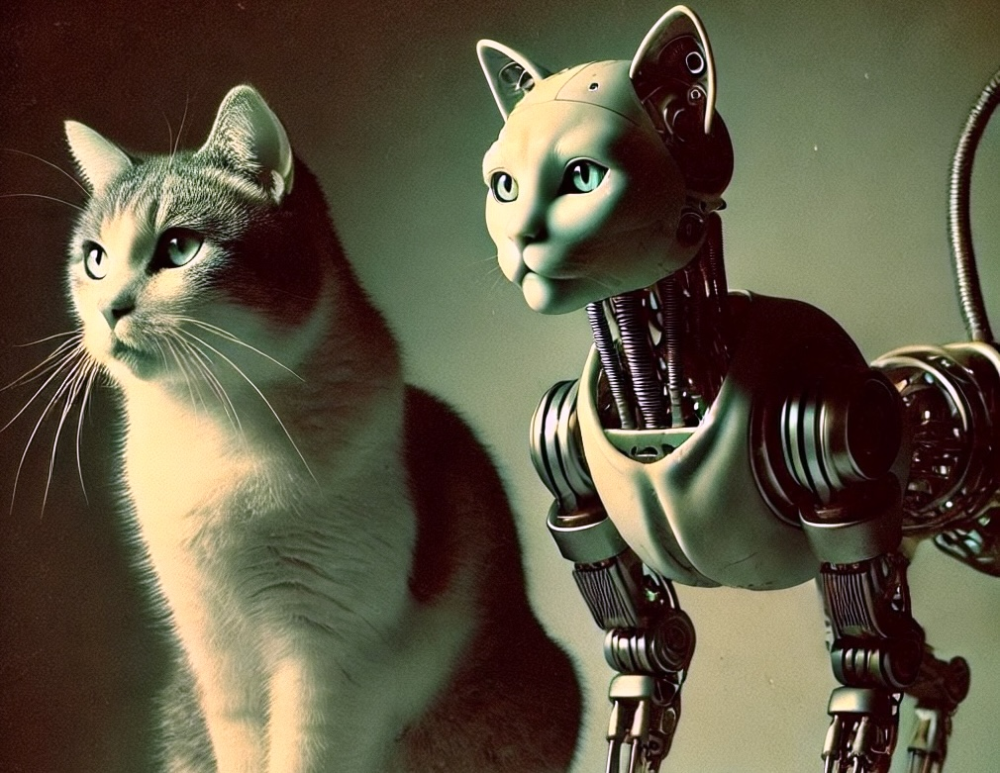

Locality-sensitive hashing: MinHash
###################################
:date: 2023-07-14 21:33
:tags: algorithm

Imagine you’re building a meme recommendation system. Users upload memes, and your task is to find all similar ones quickly. A meme is described by a set of features e.g. ["*sun*", "*dog*", "*car*"]. Memes are considered similar if they share most of their features:

.. code-block:: Python

    mem_1 = ["floor", "sun", "dog", "car"]      # similar
    mem_2 = ["sun", "ball", "dog", "car"]       # similar

    mem_3 = ["tree", "grass", "dog"]            # different

How would you find all similar memes?

A straightforward approach would be to directly compare every meme with every other meme. However, For **N** memes this results in O(**N**\ :sup:`2`) comparisons - clearly not efficient. We can do better!

Lets think about it. If two memes share most of thier features, then picking a random feature from the combined list of thier features has high chance to be present in both. If we repeat this process multiple times, similar memes will match more frequently then different ones:

.. code-block:: Python

    mems = [mem_1, mem_2, mem_3]
    all_features = ["floor", "sun", "dog", "car", "ball", "tree"]

    while all_features and memes:
        f = pick_random_feature(all_features)
        similar_mems = mems.find_all(f)
        mark_similar_mems(similar_mems)
        mems.remove(similar_mems)
        all_features.remove(f)

Notice that when we actually pick a random feature, remove it from **all_features**, and pick another one, what we’re really doing is generating a random ordering of the features. Instead of this cumbersome process, we could simply *shuffle* **all_features** and process them in order:

.. code-block:: Python

    mems = [mem_1, mem_2, mem_3]
    all_features = ["floor", "sun", "dog", "car", "ball", "tree"]

    random.shuffle(all_features)
    for f in all_features:
        if not mems:
            break
        similar_mems = mems.find_all(f)
        mark_similar_mems(similar_mems)
        mems.remove(similar_mems)

But we can simplify it even further! Rather than shuffling, we can use a hash function to generate a consistent ordering. In fact, we only care about the smallest hash value for each meme’s feature list. A minimum hash:

.. code-block:: Python

    mems = [mem_1, mem_2, mem_3]

    min_hashes = []
    for m in mems:
        min_hash = m.find_min_hash(hash_func)
        min_hashes.append(min_hash)

    similar_groups = group_by_hash(mems, min_hashes)

If we repeat this process using different hash functions, the most similar memes will end up in the same groups more frequently.

The algorithm I’ve just described is called `MinHash <https://en.wikipedia.org/wiki/MinHash>`_, and it’s a powerful technique for grouping similar sets of items efficiently.
